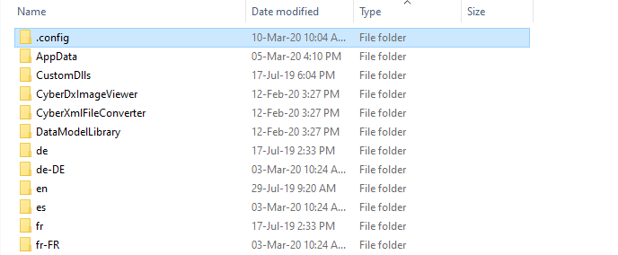
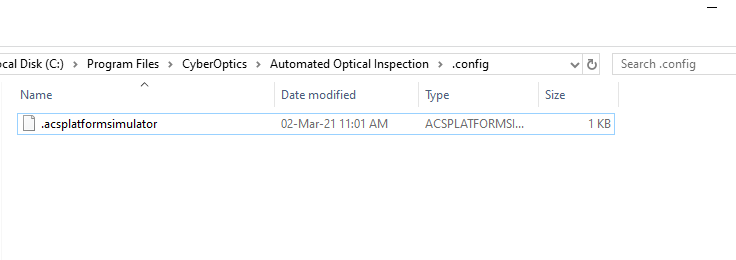
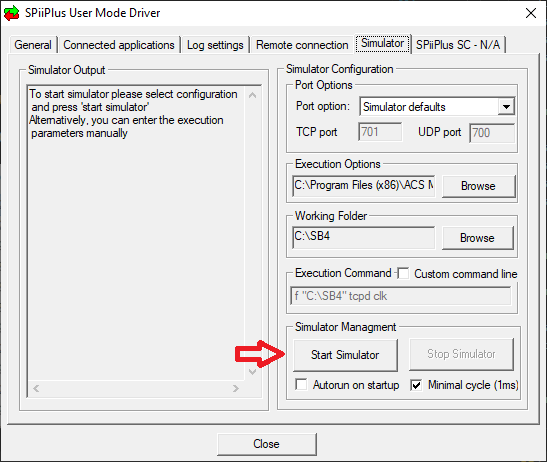
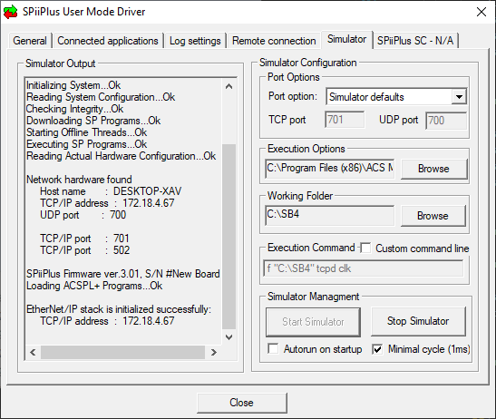
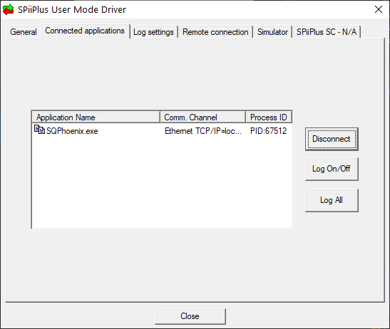
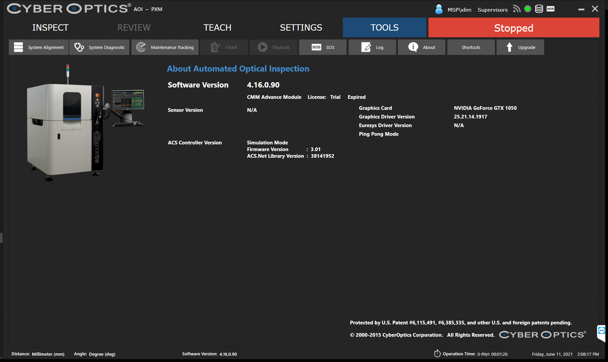
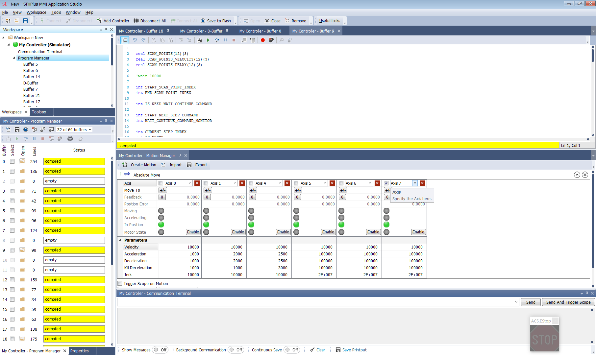

# ACS Wrapper Class
Wrapper for ACS.SPiiPlusNET library to provide interactive interface with ACS Controller.

### Library Classes
- AcsWrapper - main class for AcsWrapper .dll library
- AcsAxis - model class for servo axis status and operation
- AcsBuffers - enum for buffer index, matching the index for the buffers running on ACS controller 
- AcsUtil - provide utility functions for accessing/writing variables, value, registries in ACS controller
- BufferHelper - provide helper functions for accessing buffer in ACS controller and writing buffer to ACS controller

### Support Modes
- Real mode - connect to ACS controller via Ethernet connection and operate on the real platform
- Simulation mode (with ACS UMD simulator) - connect to ACS' SPiiPlus User-Mode Driver (UMD) simulator for simulation with simulated IO's and motion axes
- Simulation mode (with mocked AcsWrapper) - no any connection established, pure AcsWrapper mocking to enable SQ to run ACS machine type in simulation mode

All simulation modes run with SQPhoenix' OperationMode set to Online mode.

### ACS Buffers
ACS controller control the machine operation using programming script called 'buffer', all the buffers file used for the platform control are store in the directory:
- .\AcsWrapper\resources\buffers\real, and
- .\AcsWrapper\resources\buffers\simulation

Buffers in 'real' folder will be used in Real mode, while buffers in 'simulation' folder will be used in Simulation mode with ACS simulator

Buffer files will be packed into SQPhoenix installer package and can be found in the following directory after installation:
- .\AppData\acs\buffers

## ACS Platform Simulation
### Enabling/Disabling the Simulator
The simulator can be enabled by added the file '\.config\.acsplatformsimulator' under the binary directory (where SQPhoenix.exe located).  
When enabled, the SQPhoenix with MachineType.SQ3000ACS configured will launch into simulation mode.

to disable the simulation, simply delete the .acsplatformsimulator file.

### Simulation Mode with Mocked AcsWrapper
When simulation is enabled and ACS simulator is not running, launched SQPhoenix will automatically switch to running simulation mode with Mocked AcsWrapper. Information about the Mocked Simulation Mode will be shown on About Page.  

### Simulation Mode with ACS UMD Simulator
#### Setup
Install the SDK Suite for ACS Controller: SPiiPlus ADK Suite v3.01  
The installer package can be found in the following sngnas1 directory:  
[\\\sngnas1\R&D\Software\ACS\SPiiPlus-ADK-Suite-v.3.01](file://sngnas1\R&D\Software\ACS\SPiiPlus-ADK-Suite-v.3.01)

#### ACS Simulator Configuration
Launch SPiiPlus User-Mode Driver (UMD). In the UMD, go to 'Simulator' tab, click on 'Start Simulator' button to start the ACS simulator:  

When simulator is started, the 'Simulator Output' panel will show the status:  

Enable ACS Platform Simulation and launch SQPhoenix, in UMD 'Connected applications' tab will show SQPhoenix.exe as connected application:  

Information about the Simulation Mode with ACS UMD Simulator will be shown on About Page as following:  

During SQ operation under ACS UMD Simulation mode, user will be able to check the ACS UMD Simulator status by launching SPiiPlus MMI Application Studio and connect it to the UMD Simulator:

